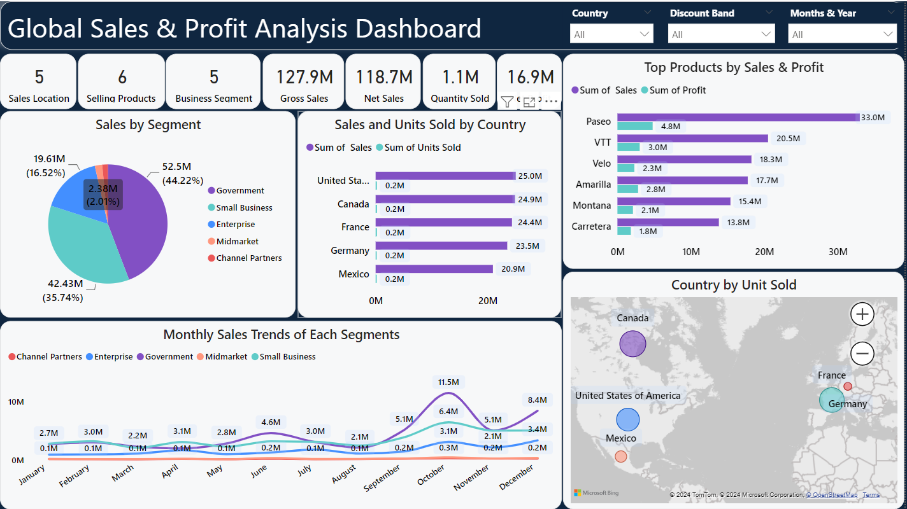
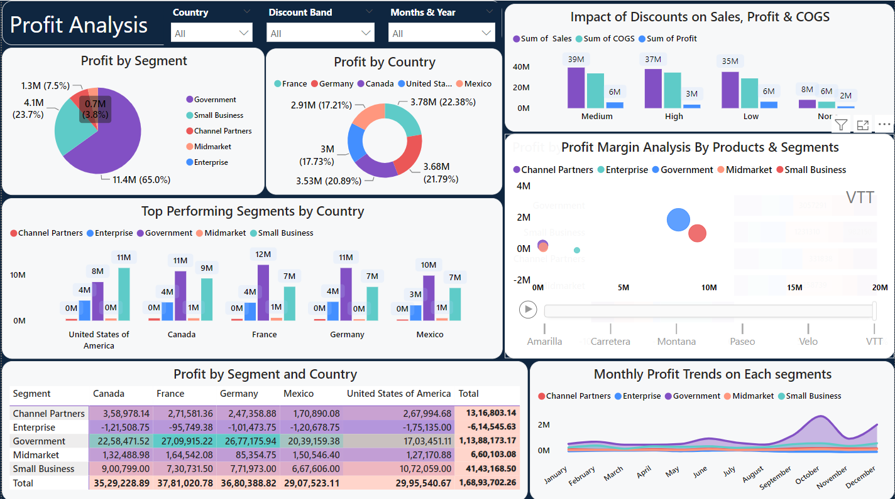

# Sales and Profit Analysis Dashboard







## Overview

This repository contains a dynamic and interactive dashboard for analyzing sales and profit data across various segments, countries, products, and discount bands. The dashboard provides insights into sales and profit performance, enabling users to explore data interactively through filters and visualizations. Key correlations and divergences in the data are highlighted to support data-driven decision-making.

## Objectives

- Provide insights into sales and profit performance.
- Enable interactive exploration of data through filters and visualizations.
- Highlight correlations and divergences in the data.

## Repository Structure

- `data/`: Raw data files.
- `notebooks/`: Jupyter notebooks for data analysis and visualization.
- `scripts/`: Python scripts for data processing and visualization.
- `dashboard/`: Code for the interactive dashboard.
- `reports/`: Generated reports and visualizations.
- `docs/`: Documentation.

## Getting Started

### Prerequisites

- Python 3.7+
- Required Python packages (listed in `requirements.txt`)

### Setup

1. **Clone the repository:**
   ```sh
   git clone https://github.com/yourusername/sales-profit-dashboard.git
   cd sales-profit-dashboard
### Install the required packages:

pip install -r requirements.txt
### Run the dashboard:
cd dashboard
python app.py
### Usage
- Navigate to http://localhost:8050 in your web browser.
- Use the filters to explore the data interactively.
- View the generated reports in the reports/ directory.
### Insights
### Sales Analysis
#### 1. Segment Analysis:

- In October, the Government segment contributed 9.67% of the total sales.
- The Government segment accounted for 44.22% of total sales overall.
#### 2. Geographical Analysis:

- The USA had the highest sales at ₹2,50,29,830.17, 19.48% higher than Mexico, which had the lowest sales at ₹2,09,49,352.11.
- The USA showed the largest divergence between sales and units sold, with sales exceeding units sold by ₹2,47,97,202.67.
#### 3. Product Analysis:

- Sales across all six products ranged from ₹1,38,15,307.89 to ₹3,30,11,143.95.
- Profits across all six products ranged from ₹18,26,804.89 to ₹47,97,437.95.
#### 4. Correlation:

- There is a positive correlation between the total sales and the total units sold.
### Profit Analysis
#### 1. Segment Analysis:

- The Government segment accounted for 62.84% of the total profit.
- In France, the Government segment made up 10.21% of the total sales.
#### 2. Product Analysis:

- The Medium discount band had the highest sales at ₹3,87,80,430.84, 388.19% higher than the None discount band at ₹79,43,654.
- Paseo had the highest sales (₹3,30,11,143.95) and the highest profit (₹47,97,437.95).
#### 3. Correlation:

- There is a positive correlation between the total sales and the total cost of goods sold (COGS).
#### 4. Discount Band Analysis:

- Sales ranged from ₹79,43,654 to ₹3,87,80,430.84.
- COGS ranged from ₹62,07,199 to ₹33,98,620.
- Profits ranged from ₹17,36,455 to ₹61,88,857.70.
### License
This project is licensed under the MIT License.

### Acknowledgements
- Thanks to all contributors and supporters of this project.
- Special thanks to the data providers and the open-source community for their invaluable resources.
