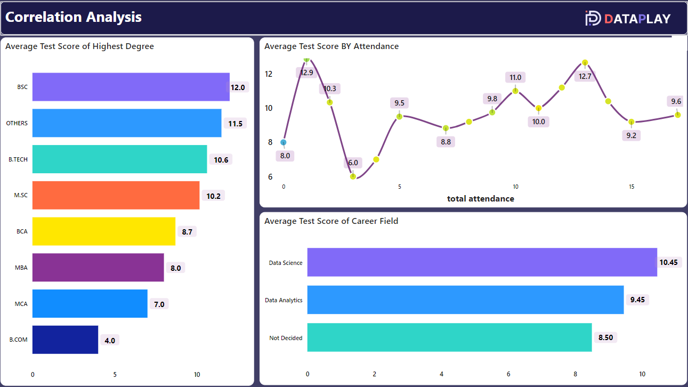
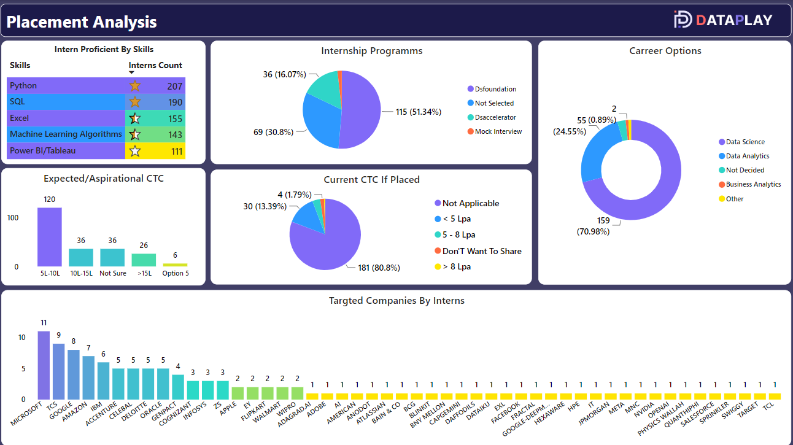

# Track Applicant Journey & Internship Program Performance

This project aims to track the applicant journey and evaluate the performance of an internship program using data wrangling techniques, KPI development, and advanced analytics.

## Table of Contents

- [Project Overview](#project-overview)
- [Features](#features)
- [Data Wrangling](#data-wrangling)
- [KPIs Developed](#kpis-developed)
- [Key Insights](#key-insights)
  - [Overview Demographics](#overview-demographics)
  - [Correlation Analysis](#correlation-analysis)
  - [Placement Analysis](#placement-analysis)
- [Dashboards](#dashboards)
- [Conclusion](#conclusion)
- [Acknowledgements](#acknowledgements)
- [License](#license)

## Project Overview

The project leverages multiple data sources to track the applicant journey from application to internship completion. By analyzing the data, we aim to optimize recruitment strategies and enhance program performance.

## Features

- **Data Integration:** Combined multiple data sources into a single dataset.
- **Data Cleaning:** Standardized formats, deduplicated records, addressed missing values.
- **Feature Engineering:** Created new features for deeper analysis.
- **Interactive Dashboards:** Provided visual insights to facilitate data-driven decisions.

## Data Wrangling

We utilized various data wrangling techniques to ensure data accuracy and integrity:
- Combined multiple data sources.
- Standardized formats.
- Deduplicated records.
- Addressed missing values.
- Created new features for enhanced analysis.

## KPIs Developed

To measure and improve our recruitment strategies, we developed key performance indicators:
- Applicant funnel analysis
- Conversion rates
- Geo-distribution
- Recruitment effectiveness

## Key Insights

### Overview Demographics

- **Highest Total Applicants:** Friend Referred had the highest total applicants at 44, which was 1,366.67% higher than Dataplay Reached Out To You with 3 applicants.
- **Positive Correlation:** Total applicants and total interns joined are positively correlated.
- **Applicant Source:** Friend Referred accounted for 57.89% of total applicants.
- **Degree Analysis:** Across the top 10 highest degrees, total applicants ranged from 1 to 139, offers sent ranged from 1 to 82, and students joined ranged from 1 to 38.
- **Placement Status:** The count of 'Already Placed' was higher for 'No' (199) than 'Yes' (25).

### Correlation Analysis

- **Orientation Test Scores:** Group 1 had the highest average score at 12.88, which was 114.58% higher than Group 3 with the lowest score at 6.00.
- Scores ranged from 6.00 to 12.88 across all 16 total attendance.

### Placement Analysis

- **Skills:** 207 interns know Python, followed by SQL and Excel.
- **Company Analysis:** Microsoft had the highest count of intern placements at 11, followed by TCS and Google.
- Microsoft accounted for 9.48% of the count of companies.
- Across all 50 companies, the count ranged from 1 to 11.

## Dashboards
Below are some of the interactive dashboards created for this project:

### Dashboard 1: Overview Demographics Analysis

### Dashboard 2: Correlation Analysis

### Dashboard 3: Placement Analysis

## Conclusion

The interactive dashboards and detailed analysis provide valuable insights, enabling data-driven decisions to enhance the internship program's impact.

## Acknowledgements

A huge thanks to DataPlay for the amazing opportunity, support, and guidance. Special thanks to Soumya Awasthi ma'am for her expert guidance in Power BI.

## Connect

Feel free to connect and share insights!

## Contact

For any inquiries or further information, please contact [Goutam Meena] at [meenagoutamo92@gmail.com].

---

## License

This project is licensed under the MIT License. See the [LICENSE](LICENSE) file for details.

